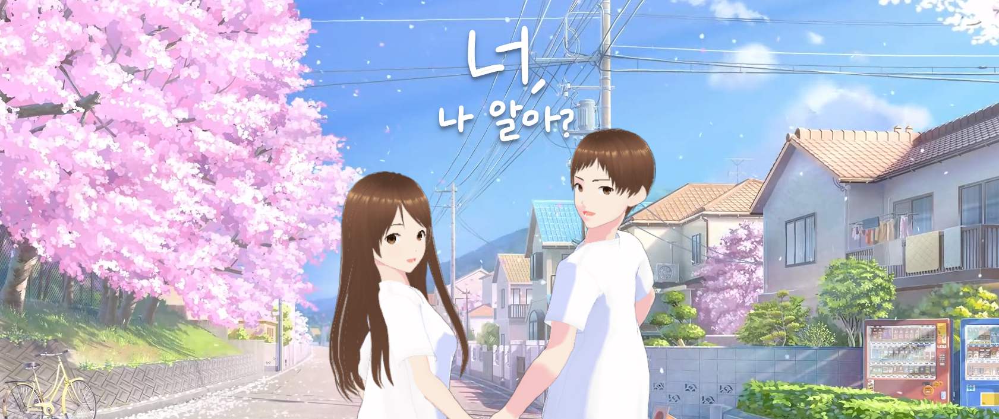
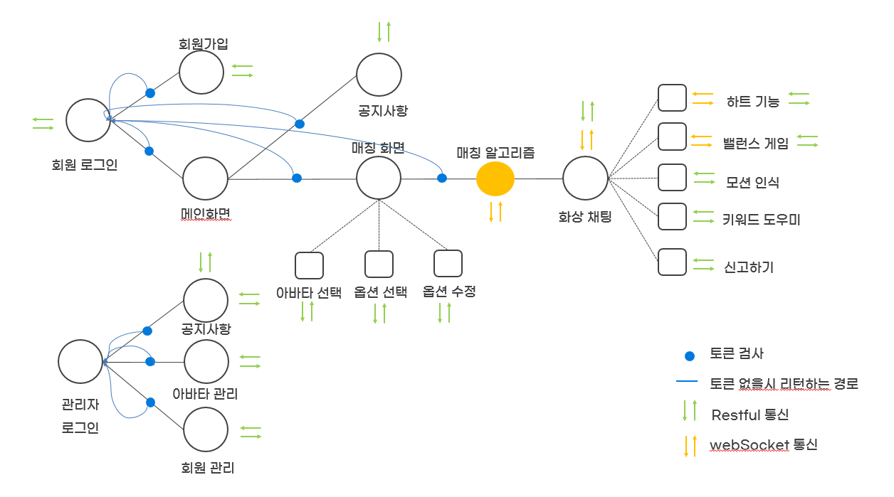
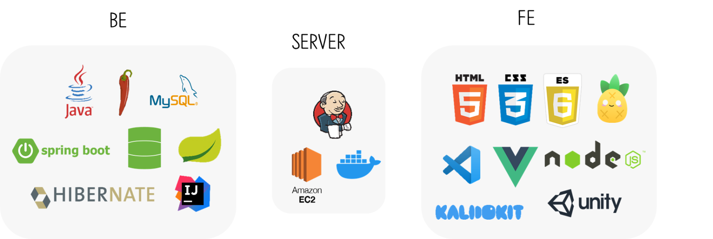
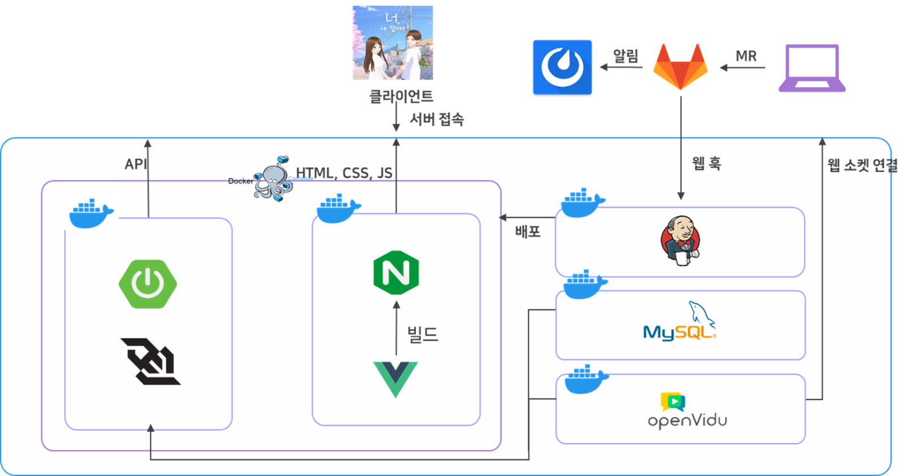

# 💟 너, 나 알아?

    

가상 아바타를 활용한 남녀 화상 소개팅 서비스. `너, 나 알아?` 입니다!

저희는 인공지능 모션 트래킹 기술을 활용해서 사용자가 캠 화면 내에서 가상 아바타로 변신하여 움직일 수 있게 했고, 이를 랜덤 채팅과 섞었습니다.

 

## ✨ 기획 배경

코로나로 인해 오프라인으로 사람을 만나기가 어려워진 요즘 남녀들을 위해 온라인으로 사람을 만날 수 있는 `남녀 화상 소개팅 서비스`를 기획했습니다. 거기에 모르는 사람들에게 얼굴을 내보이기가 꺼려지는 사용자들을 위해 사용자의 모션에 따라 움직이는 `가상 아바타`라는 컨셉을 추가하여 낯을 가리는 사람들도 자신감을 가지고 서비스를 이용하실 수 있게 구성하였습니다.

 

## 🖥️ 시스템 구조도

    

저희 서비스의 시스템 구조도입니다. 서비스에서 제공하는 기능들과 UI의 흐름, 그리고 API 통신과 웹 소켓 통신 등 서버와의 커뮤니케이션이 어떻게 이루어지는지 한 눈에 알아볼 수 있게 그림으로 정리해보았습니다. 

 

## 📚 기술 스택

저희 서비스는 정말 다양한 기술 스택들을 사용했습니다!

    

 

## 🌐 서버 아키텍처

서버 아키텍처는 다음과 같이 구성되어 있습니다! `도커`를 활용해서 프론트, 백 서버의 빌드 및 배포를 추상화하였고, `젠킨스`로 CI/CD 환경 또한 구축하였습니다.

    

 

## 🗒️ 서비스 기능

저희 서비스의 기능은 크게 회원 관리 서비스, 화상 채팅 서비스, 아바타 서비스, 매칭 서비스로 나뉩니다.

### ❤️ 회원 서비스

- [회원가입 / 로그인](./assets/description/login.md)

- [개인 정보 수정](./assets/description/modify_accounts.md)

### 🧡 화상 채팅 서비스

- [모션 인식](./assets/description/motion_tracking.md)

- [밸런스 게임](./assets/description/balance_game.md)

- [키워드 도우미](./assets/description/keyword_helper.md)

- [하트 기능](./assets/description/heart.md)

- [신고 기능](./assets/description/report.md)

### 💛 아바타 서비스

- [아바타 선택](./assets/description/avatar.md)

### 💚 매칭 서비스

- [매칭 옵션 선택](./assets/description/matching_option.md)

### 💙 기타

- [관리자 페이지](./assets/description/manager.md)

- [메타버스](./assets/description/metaverse.md)

- [공지사항](./assets/description/notice.md)

 

## 🔖 프로젝트 빌드 방법

빌드 매뉴얼은 길어질 것 같아 따로 페이지를 만들어 두었습니다!

    

 

## 📝 노션 페이지

저희 프로젝트의 문서와 저희 팀원들이 어떤 방법론에 맞춰 작업했는지 알고 싶으시다면 저희 프로젝트 노션 페이지를 방문해주세요!

    

