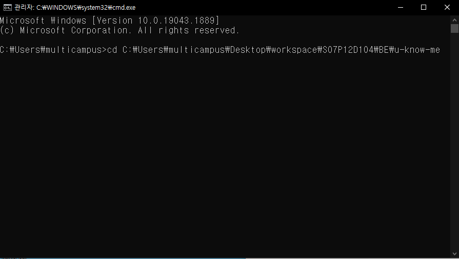
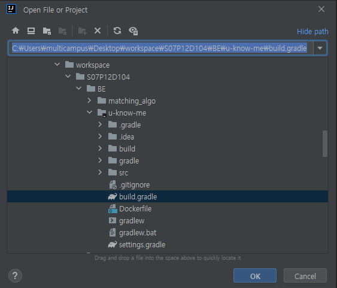
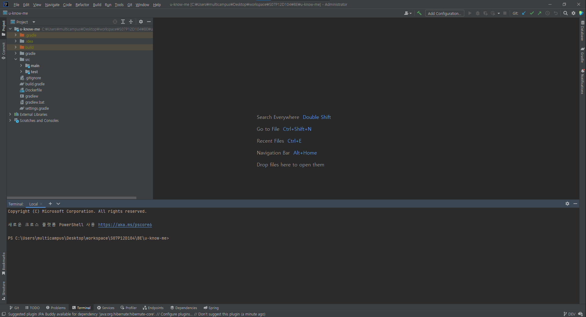
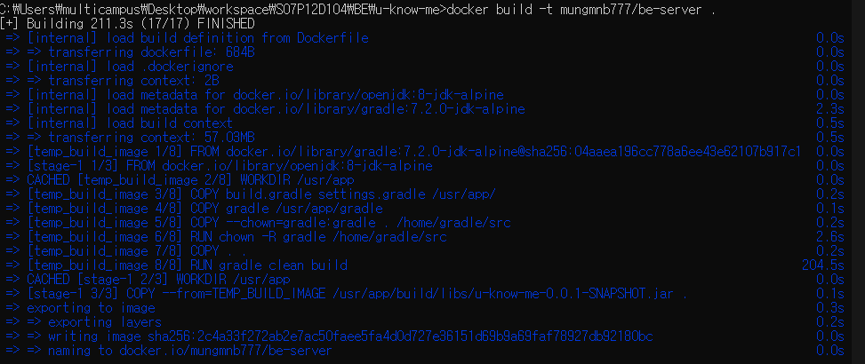
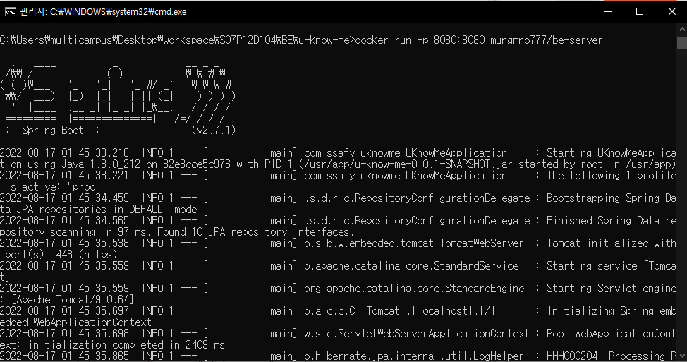
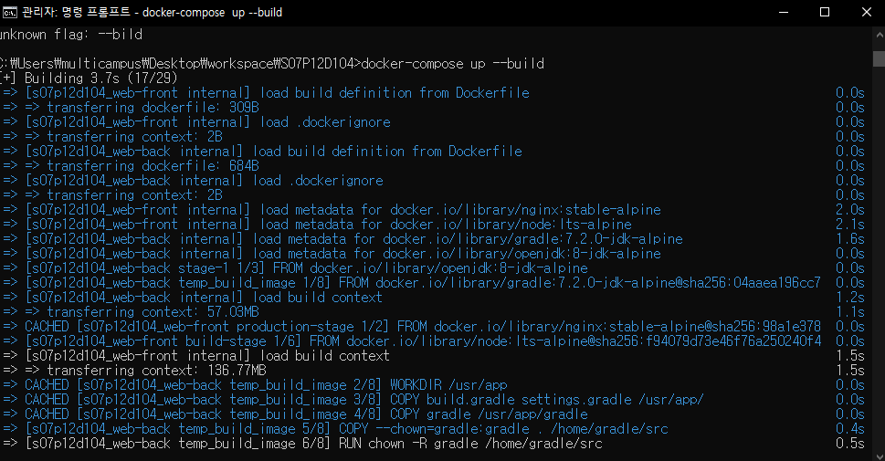

# 빌드 매뉴얼

## 1. Gitlab에서 프로젝트 클론하기

1. 작업할 공간에 폴더를 하나 생성합니다.
2. 생성한 폴더를 열고 해당 위치에서 `Git Bash`를 열어줍니다. (`CMD`와 같은 다른 터미널도 상관없습니다!)
3. `git clone https://lab.ssafy.com/s07-webmobile1-sub2/S07P12D104.git`를 터미널에 입력해줍니다.
4. 그러면 `S07P12D104` 폴더가 생깁니다. 앞으로 이 폴더를 `root directory`라고 하겠습니다. 이후 프론트엔드, 백엔드에 따라 원하는 작업 공간으로 가서 빌드 과정을 수행해주시면 됩니다.
    - 프론트엔드 : `FE/u-know-me`
    - 백엔드 : `BE/u-know-me`

<br>

## 2. 스프링부트 WAS 빌드

스프링부트 WAS를 빌드하는 방법은 두 가지 있습니다.

- 프로젝트를 gradle로 직접 빌드하는 방법
- 도커 컨테이너를 이용하는 방법

### 2.1. gradle로 직접 빌드하는 방법 (CMD 버전)

1. `Win + R`을 누르고 `cmd`를 입력하고 확인 버튼을 누릅니다. 그러면 명령 프롬프트 창을 띄울 수 있습니다.
2. 백엔드 작업 공간으로 이동해줍니다. 저의 경우에는 백엔드 작업 공간이 `C:\Users\multicampus\Desktop\workspace\S07P12D104\BE\u-know-me`입니다. 앞에 `cd` 명령어를 붙이시면 해당 디렉토리로 이동할 수 있습니다.

    <div align="center">
        
        <em>그림 1) 명령 프롬프트 cd 명령어</em>
    </div>

    <br>
    
3. 그 후 `gradle`을 이용하여 빌드해줍니다. `cmd`에 `gradlew clean build` 명령어를 입력합니다. 그러면 서버 내부에서 진행하는 테스트 코드를 수행한 후 빌드 파일이 생깁니다.
4. `cd build/libs` 명령어를 입력해서 빌드 파일이 있는 위치로 이동한 후 `java -jar u-know-me-0.0.1-SNAPSHOT.jar` 명령어를 입력해줍니다.
    
    → 추가로 `java -jar u-know-me-0.0.1-SNAPSHOT.jar --spring.profiles.active=prod`이라고 입력하면 운영 환경으로 설정하여 배포할 수 있지만, 현재 서버 호스트 출처가 `https://uknowme.mooo.com:8443`으로 어플리케이션에 직접 설정해두어서 정상 작동하지 않을 수 있습니다.. 추후에 환경 변수로 설정할 수 있도록 리팩토링 해보겠습니다!
    
5. 위의 과정을 마치면 로컬 환경에서 서버 빌드 및 배포가 되었습니다. `[http://localhost:8080/swagger-ui/](http://localhost:8080/swagger-ui/)`로 접속하시면 API를 확인하실 수 있습니다.

### 2.2. gradle로 직접 빌드하는 방법 (IntelliJ)

1. 인텔리제이를 통해 해당 프로젝트를 열어줍니다.

    <div align="center">
        
        <em>그림 2) 오픈 프로젝트를 통해 백엔드 프로젝트 열기</em>
    </div>

    <br>
    
2. `Alt + F12`를 눌러 터미널을 열어줍니다.

    <div align="center">
        
        <em>그림 3) 터미널을 연 상태의 IntelliJ</em>
    </div>

    <br>
    
3. 터미널에 `./gradlew clean build` 명령어를 입력합니다.
4. `BUILD SUCCESSFUL`이 뜨면 `cd build/libs` 명령어를 입력해서 빌드 파일이 있는 위치로 이동한 후 `java -jar u-know-me-0.0.1-SNAPSHOT.jar` 명령어를 입력해줍니다.
5. 스프링부트 서버가 정상적으로 올라가면 `[http://localhost:8080/swagger-ui/](http://localhost:8080/swagger-ui/)`로 접속하셔서 API를 확인하실 수 있습니다.

### 2.3. 도커 컨테이너를 이용하는 방법

도커를 이용하려면 도커를 미리 설치해주셔야 합니다.

1. `Win + R`을 누르고 `cmd`를 입력하고 확인 버튼을 눌러 CMD 창을 띄웁니다.
2. `work directory` 기준 `BE/u-know-me` 디렉토리로 이동해줍니다. 
3. `dir` 명령어를 입력한 후 폴더에 `Dockerfile`이 있는지 확인해줍니다.
4. `docker build -t (도커 허브 아이디)/(이미지 이름) .`으로 도커 이미지를 생성해줍니다.

    <div align="center">
        
        <em>그림 4) 도커 이미지 빌드</em>
    </div>

    <br>
    
5. `docker run -p 8080:8080 (도커 허브 아이디)/(이미지 이름)`으로 컨테이너를 생성해줍니다. 그러면 8080번 포트로 서버가 열리게 됩니다!

    <div align="center">
        
        <em>그림 5) 스프링부트 서버 도커 컨테이너 생성</em>
    </div>

    <br>
    
    ```docker
    # 그래들 빌드하는 부분
    FROM gradle:7.2.0-jdk-alpine AS TEMP_BUILD_IMAGE
    ENV APP_HOME=/usr/app
    WORKDIR $APP_HOME
    COPY build.gradle settings.gradle $APP_HOME/
      
    COPY gradle $APP_HOME/gradle
    COPY --chown=gradle:gradle . /home/gradle/src
    USER root
    RUN chown -R gradle /home/gradle/src
    
    COPY . .
    RUN gradle clean build
        
    # actual container
    FROM openjdk:8-jdk-alpine
    ENV ARTIFACT_NAME=u-know-me-0.0.1-SNAPSHOT.jar
    ENV APP_HOME=/usr/app
        
    WORKDIR $APP_HOME
    COPY --from=TEMP_BUILD_IMAGE $APP_HOME/build/libs/$ARTIFACT_NAME .
        
    EXPOSE 8080
    ENTRYPOINT exec java -jar ${ARTIFACT_NAME} --spring.profiles.active=prod
    ```
    
    **참고로 로컬 환경에서 빌드하시는 경우 Dockerfile의 마지막 줄 `—spring.profile.active=prod`를 지우셔야 합니다!! 하지 않으시면 저희가 개발에 사용했던 운영 환경으로 빌드 및 배포가 진행됩니다!**

<br>

## 3. 프론트엔드 웹 서버 빌드

프론트엔드 웹 서버의 경우 도커 컨테이너를 이용하는 것이 편하기 때문에 도커 컨테이너를 이용한 빌드 방법에 대해서 설명하겠습니다. 방법은 `3.2.3`에서 진행한 방법과 똑같습니다.

### 3.1. 도커 컨테이너를 이용한 빌드

1. `Win + R`을 누르고 `cmd`를 입력하고 확인 버튼을 눌러 CMD 창을 띄웁니다.
2. `work directory` 기준 `FE/u-know-me` 디렉토리로 이동해줍니다. 
3. `dir` 명령어를 입력한 후 폴더에 `Dockerfile`이 있는지 확인해줍니다.
4. `docker build -t (도커 허브 아이디)/(이미지 이름) .`으로 도커 이미지를 생성해줍니다. (점까지 붙여야 돼요)
5. `docker run -p 3000:80 (도커 허브 아이디)/(이미지 이름)`으로 컨테이너를 생성해줍니다. 그러면 3000번 포트로 프론트 웹 서버가 열리게 됩니다!

→ 프론트 빌드 시 알아두어야 할 부분이 있습니다! 프론트 대부분의 로직이 스프링 부트 WAS와 ajax 통신을 통해서 데이터를 가져오게 됩니다. 현재 ajax 통신에서 HOST 설정이 `https://uknowme.mooo.com:8443`으로 되어있는데, 로컬에서 빌드하시는 경우 이 주소를 변경해주어야 합니다. (위의 스프링 부트 빌드 방법을 따라하셨다면 `http://localhost:8080`으로 변경해주시면 됩니다.

```docker
FROM node:lts-alpine as build-stage
WORKDIR /app
COPY package*.json ./
RUN npm install
COPY . .
RUN npm run build

FROM nginx:stable-alpine as production-stage
COPY --from=build-stage /app/dist /usr/share/nginx/html
EXPOSE 80
CMD ["nginx", "-g", "daemon off;"]
```

도커 파일의 내용은 위와 같습니다!

<br>

## 4. docker-compose를 이용하여 프론트, 백엔드 동시 빌드

1. `Win + R`을 누르고 `cmd`를 입력하고 확인 버튼을 눌러 CMD 창을 띄웁니다.
2. `work directory`로 이동해줍니다.
3. `docker-compose up --build`를 통해 실행시켜주시면 프론트엔드, 백엔드 동시에 빌드 및 배포하실 수 있습니다!

    <div align="center">
        
        <em>그림 6) 도커 컴포즈를 이용한 서버 빌드</em>
    </div>

    <br>
    